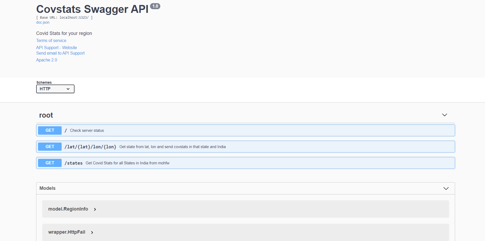

# covstats

REST APIs for covid stats of India and its States from mohfw,
with reverse geocoding support to get covid stats of relevant 
State. Built with Golang, Echo framework and MongoDB


## How to run

 1. Install golang, mongodb. Run mongodb  

    Note: middlware is commented out at the moment

 2. Clone the project outside of `$GOPATH` directory 

 3. Go to root directory of project and make changes to `config/config.json`

 4. Run `/path/to/covstats$ go mod tidy`
 
 5. Run `/path/to/covstats$ go run server.go"` to start the server
 
 6. In browser go to `localhost:1323/swagger/index.html` to understand the APIs ( alternatively import covstats.postman_collection.json
     in postman) and to make calls to server for response.

 7. From swagger you can test the APIs. Set `lat:16.3` and `lon:80.4` for reverse gecoding API use case.


## Application

>The request header should contain ( middleware part of code in server.go should not be commented for this):
```Content-Type: "application/json"```
>The error response should be:

```json
{
  "code": "<HTTP STATUS CODE: Error>",
  "data": null,
  "message":"Error message",
  "success": false
}
```

>The success response should be:

```json
{
  "code": "<HTTP STATUS CODE: Success>",
  "data": "<MULTI DATA TYPE: array, stirng and object>",
  "message":"Success message",
  "success": true
}
```

## Future Work / Todos

1. Unit Tests
2. Heroku Deploy with addons for db along with redis caching layer
3. Validation of lat, lon needs review, handled by locationiq server tentatively
4. Swagger docs can be packed with more info
5. Static assets
6. User authentication

## Preview of APIs with Swagger



## References

1.  https://github.com/sangianpatrick/go-echo-mongo           -  skeleton of project: code structure and mongodb setup
2.  https://gist.github.com/border/3489566 
    https://pkg.go.dev/labix.org/v2/mgo#Query.Sort            -  for sorting results based on time
3.  https://www.mohfw.gov.in/data/datanew.json                -  for statewise covid data
4.  https://betterprogramming.pub/intro-77f65f73f6d3          -  intro to echo and for making client api calls 
5.  https://blog.logrocket.com/making-http-requests-in-go/    -  more info on echo 
6.  https://www.youtube.com/watch?v=C8LgvuEBraI               -  go quick intro 
7.  https://github.com/swaggo/swag                            -  swagger api docs with examples
8.  swag init -g ./server.go --output ./docs/swagdocs         -  command to generate swagger docs